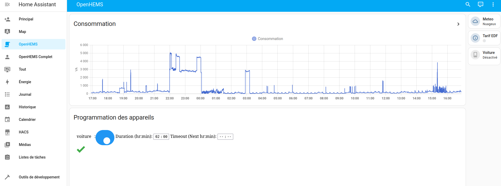

<!-- markdown file presented on the main addon info tab -->

# OpenHEMS Add-on


[![GitHub Release][releases-shield]][releases]
![Project Stage][project-stage-shield]
[![License][license-shield]](LICENSE)


![Supports aarch64 Architecture][aarch64-shield]
![Supports amd64 Architecture][amd64-shield]
![Supports armhf Architecture][armhf-shield]
![Supports armv7 Architecture][armv7-shield]
![Supports i386 Architecture][i386-shield]

[![Github Actions][github-actions-shield]][github-actions]
![Project Maintenance][maintenance-shield]
[![GitHub Activity][commits-shield]][commits]

[![Discord][discord-shield]][discord]
[![Community Forum][forum-shield]][forum]

[![Sponsor OpenHomeSystem via GitHub Sponsors][github-sponsors-shield]][github-sponsors]

[![Support OpenHomeSystem][patreon-shield]][patreon]



Python Apps and HADashboard for Home Assistant

### A Home Assistant Add-on for the OpenHEMS module: Home Energy Management System for Home-Assistant

</br>

<div style="display: flex;">
This add-on uses the OpenHEMS-sample core module from the following GitHub repository:
&nbsp; &nbsp;
<a style="text-decoration:none" href="https://github.com/abriotde/openhems-sample">
    
</a>
</div>

</br>

<div style="display: flex;">
The complete documentation for this module can be found here:
&nbsp; &nbsp;
<a style="text-decoration:none" href="https://openhems-sample.readthedocs.io/en/latest/">
    
</a>
</div>

</br>

<div style="display: flex;">
For any questions on openhems-sample or openhems-sample-Add-on:
&nbsp; &nbsp;
<a style="text-decoration:none" href="https://community.home-assistant.io/t/openhems-sample-an-energy-management-for-home-assistant/338126">
    
</a>
</div>

</br>

<div style="display: flex;">
For any Issues/Feature Requests for the openhems-sample core module, create a new issue here:
&nbsp; &nbsp;
<a style="text-decoration:none" href="https://github.com/abriotde/openhems-sample/issues">
    
</a>
</div>

## Installation

The steps to install openhems-sample as an Home Assistant addon:

1) Add the openhems-sample-Add-on repository to the HAOS add-on store

    - To install add the openhems-sample Add-on repository in the Home Assistant store, follow [these steps](https://www.home-assistant.io/common-tasks/os/#installing-third-party-add-ons)

    - This will be: Configuration > Add-ons & Backups open the add-on store > Add the URL of the repository (e.g https://github.com/abriotde/openhems-sample-add-on) and then press "Add".

2) Install the openhems-sample Add-on 
    - Look for the openhems-sample Add-on tab and when inside the Add-on click on `install`.
      - The installation may take some time depending on your hardware.

3) Start the openhems-sample addon
    - Once installed, head into the openhems-sample addon
    - click `start` to start the openhems-sample web server
      -  For consistent use, it is recommended that you enable: `Show in sidebar`,`Watchdog` and `Start on boot `

4) Open the openhems-sample web interface, and configure parameters
    - Click `OPEN WEB UI` to enter the openhems-sample web server
    - Click the cog icon ⚙️  to to enter the openhems-sample configuration page
    - Insert your user specific parameters
      - For users who wish to use `Solcast` or `Forecast.Solar` insert your secrets in the Home Assistant openhems-sample configuration page, under `Show unused optional configuration options`. (E.g: `localhost:8123/hassio/addon/openhems-sample/config`)

## Installation Method 2 - Manually changing openhems-sample version
This method allows the user to select which openhems-sample version to run _(via adjusting the Docker version tag)_. This second method of installation may be more preferable for users who wish to test openhems-sample or rollback to a older stable version.   
_Warning: This method will override the Docker image tag, and therefore will require the user to manually adjust the tag to update. The user will also need to regularly check to see if the openhems-sample-Add-on repository is up to date with the Github `main` branch_

1) Have a method of inserting commands
    - Two Addon options are [Terminal & SSH](https://github.com/home-assistant/addons/tree/master/ssh) and Community Add-on: [Studio Code Server](https://github.com/hassio-addons/addon-vscode)

2) Clone the `openhems-Add-on` repository into your `/addons` directory 
    ```bash
    cd ~/addons/
    git clone https://github.com/abriotde/openhems-sample-add-on.git
    ```

3) Specify what openhems-sample version image to use
    - in the `openhems-add-on/openhems/config.yaml` adjust the `version:` line to match the version of choice:
      ```bash
      # set version here 
      OpenhemsVersion=v0.1.8
      # sed command to replace version line in config.yml 
      sed -i.bak "s/version:.*/version: $OpenhemsVersion/g"  ~/addons/openhems-add-on/openhems-sample/config.yml
      ```
4) Head to the Home Assistant add-on store and refresh addon cache
    - Settings > Add-ons > Add-on Store
    - Refresh Addon cache with: hamburger icon ☰ > Check for updates
    - Wait half a minute and refresh the page 

5) Install local version of openhems-sample 
    - From here a new Addon Source under the name `Local add-ons` should appear _(if not repeat step 4)_
    - Install the openhems-sample addon, Note: after clicking the openhems-sample addon, the `Current version: ` Tag on the top left of the openhems-sample card.


## Developing openhems/openhems-Add-on

#### **openhems-sample**
For those who want to develop the openhems-sample package itself. Have a look at the [Develop page](https://openhems-sample.readthedocs.io/en/latest/develop.html). _(openhems-sample docs)_ 

#### **openhems-sample-Add-on**
For those who want to test the openhems-sample addon _(openhems-sample inside of a virtual Home Assistant Environment)_. Have a look at [Test Markdown](./openhems-sample/Test.md).
